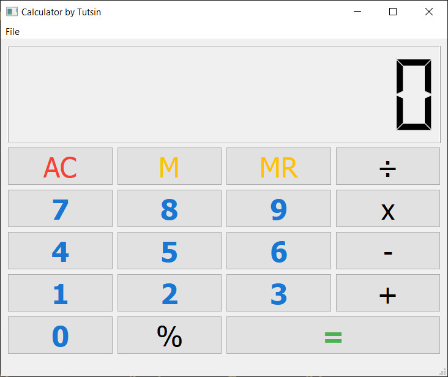

# Calculator - A desktop calculator in PyQt5 Usin UI.

A simple calculator application implemented in Python using PyQt5. The UI was designed in Qt Designer and the 
calculator operations are implemented using simple stack-based logics.

Python3 Or Any stable version Above 2.7
# Libraries used
# Installation of Libraries will be done by usig PIP.
PyQt5>=5 Or New
PyQtWebEngine

 Want to learn more & Check new tutorials about
Python in general, visit (https://tutsin.in)

